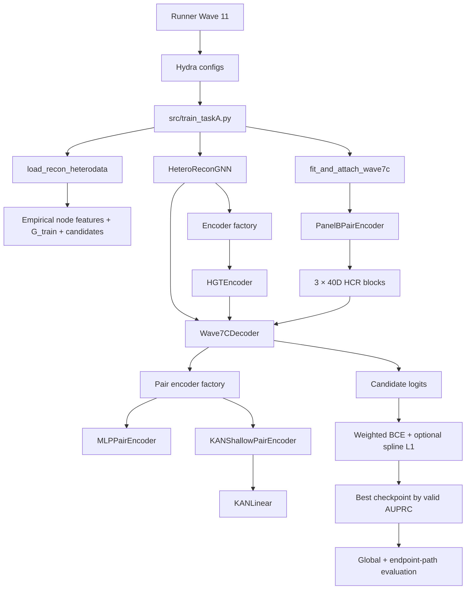

# Mapa kodu finalnego MLP i najlepszego KAN

## Najważniejsza uwaga

`configs/model/TaskA_hgt_hcr.yaml` jest historycznym modelem Wave 3:
HGT L1, hidden 64 i HCR 8D. Nie opisuje finalnego MLP ani KAN.

Źródłem finalnego stacku jest:

- `configs/model/TaskA_hgt_wave7c.yaml`;
- `configs/hcr/w7c_b2_audit.yaml`;
- `configs/taskA/mlp_full_retrain.yaml`;
- `configs/taskA/kan_architectures/k1_shallow.yaml`.

## 1. Struktura najważniejszych katalogów

```text
GraphNeuralNetwork_Thesis/
├── configs/
│   ├── config.yaml
│   ├── data/
│   │   └── dataset_v3.yaml
│   ├── hcr/
│   │   └── w7c_b2_audit.yaml
│   ├── model/
│   │   └── TaskA_hgt_wave7c.yaml
│   └── taskA/
│       ├── mlp_full_retrain.yaml
│       ├── kan_full_retrain.yaml
│       └── kan_architectures/
│           ├── k1_shallow.yaml
│           ├── k2_mlp_to_kan.yaml
│           ├── k3_kan_to_linear.yaml
│           ├── k4_linear_plus_kan.yaml
│           └── k5_grouped_kan.yaml
│
├── scripts/
│   ├── run_taska_mlp_vs_kan_scenarios.py
│   ├── run_taska_kan_architecture_audit.py
│   ├── run_taska_kan_arch_multiseed.py
│   ├── run_taska_kan_arch_full_scenarios.py
│   ├── build_taska_edge_endpoint_registry.py
│   ├── eval_taska_run_endpoint_paths.py
│   ├── run_taska_winner_rare_endpoint_audit.py
│   └── upload_taska_results_to_wandb.py
│
├── src/
│   ├── train_taskA.py
│   ├── data/
│   │   ├── patient_matrix.py
│   │   └── PreprocessingTaskA/
│   │       ├── hetero_data_v2_2.py
│   │       ├── load_hetero_recon_data.py
│   │       └── feature_ablation.py
│   ├── hcr/
│   │   ├── variable_specs_v3.py
│   │   └── wave7/
│   │       ├── panel_b/
│   │       │   ├── packing.py
│   │       │   ├── summaries.py
│   │       │   └── jitter.py
│   │       └── wave7c/
│   │           └── attach.py
│   ├── models/TaskA/
│   │   ├── hetero_gnn.py
│   │   ├── wave7c_decoder.py
│   │   ├── encoders/
│   │   │   ├── factory.py
│   │   │   ├── input_projection.py
│   │   │   └── hgt.py
│   │   └── pair_encoders/
│   │       ├── factory.py
│   │       ├── mlp.py
│   │       ├── kan_shallow.py
│   │       ├── kan_linear.py
│   │       ├── kan.py
│   │       ├── mlp_to_kan.py
│   │       ├── kan_to_linear.py
│   │       ├── linear_plus_kan.py
│   │       └── grouped_kan.py
│   └── evaluation/
│       ├── synthetic_evaluator.py
│       ├── taskA_endpoint_reachability.py
│       └── oversmoothing_metrics.py
│
└── outputs/
    └── wave11_taskA/
        ├── mlp_vs_kan_full/
        └── kan_architecture_audit/
```

## 2. Kolejność czytania kodu

### Krok 1 — główny config treningu

Plik:

`configs/config.yaml`

Za co odpowiada:

- learning rate, optimizer i weight decay;
- maksymalna liczba epok;
- seed inicjalizacji;
- selection metric;
- early stopping;
- W&B;
- ustawienia historycznych residuali.

Ważne: `training.batch_size: 32` nie jest używane w głównej pętli Task A.

### Krok 2 — config danych

Plik:

`configs/data/dataset_v3.yaml`

Za co odpowiada:

- ścieżki do nodes, edges i plików sześciu scenariuszy;
- `negative_ratio=3`;
- `candidate_seed=20260722`;
- empirical node feature profile;
- reverse edges;
- wybór scenariusza.

### Krok 3 — config finalnego HGT i dekodera

Plik:

`configs/model/TaskA_hgt_wave7c.yaml`

Za co odpowiada:

- HGT L3, heads 8, hidden 32;
- leaky ReLU, dropout 0.2, residual;
- wybór `decoder.name=wave7c`;
- domyślne parametry pair encodera;
- wyłączenie triple/CMI i AG residualu.

Nie używaj do finalnej analizy:

`configs/model/TaskA_hgt_hcr.yaml`

To Wave 3: HGT L1 i HCR 8D.

### Krok 4 — config HCR/GHCR

Plik:

`configs/hcr/w7c_b2_audit.yaml`

Za co odpowiada:

- HCR włączone;
- pair dimension 40;
- motif dimension 120;
- fit tylko na train;
- minimalny support;
- bootstrap seed;
- count cap percentile 99.5.

### Krok 5 — config konkretnego modelu

Finalny MLP:

`configs/taskA/mlp_full_retrain.yaml`

Najlepszy KAN:

`configs/taskA/kan_architectures/k1_shallow.yaml`

Tutaj najłatwiej zobaczyć jedyną różnicę:

- MLP: `pair_encoder.type=mlp`, 40→16→8;
- KAN: `pair_encoder.type=kan_shallow`, 40→8.

### Krok 6 — runner pełnego MLP vs direct KAN

Plik:

`scripts/run_taska_mlp_vs_kan_scenarios.py`

Najważniejsze funkcje:

- `build_train_cmd()` — składa pełne polecenie Hydra;
- `run_one()` — uruchamia jeden model/scenario/seed;
- `summarize()` — buduje globalne i scenariuszowe CSV;
- `main()` — pętla 2×6×3.

Runner wymusza:

- identyczne seedy danych i treningu;
- full retrain bez checkpointu;
- HGT L3H8W32;
- unshared role encoders;
- brak CMI i AG residualu;
- endpoint-path evaluation po każdym runie.

Ten runner odpowiada za `TA_MLP` i dwuwarstwowy direct `TA_KAN`.
Nie jest głównym runnerem K1 shallow.

### Krok 7 — runner K1–K5

Plik:

`scripts/run_taska_kan_architecture_audit.py`

Najważniejsze funkcje:

- `build_cmd()` — zamienia config K1–K5 na override Hydra;
- `run_one()` — wykonuje pojedynczą architekturę;
- `write_promotion_decision()` — wybiera warianty do multi-seed;
- `main()` — screen clean i multihospital.

K1 shallow jest konfigurowany tutaj przez:

`model.decoder.pair_encoder.type=kan_shallow`.

Dalsze etapy:

- `scripts/run_taska_kan_arch_multiseed.py` — K1/K2, 2 scenariusze, 3 seedy;
- `scripts/run_taska_kan_arch_full_scenarios.py` — K1, 6 scenariuszy, 3 seedy.

### Krok 8 — wejście do treningu

Plik:

`src/train_taskA.py`

Najważniejsze funkcje:

- `main(cfg)` — cały pipeline jednego runu;
- `build_model()` — tworzy `HeteroReconGNN`;
- `train_epoch()` — jeden full-batch forward/backward/optimizer step;
- `prefix_metrics()` — nazwy metryk.

Kolejność w `main()`:

1. ustalenie seeda i urządzenia;
2. załadowanie train/valid/test graph data;
3. dopasowanie i dołączenie HCR;
4. budowa modelu;
5. optimizer i weighted BCE;
6. pętla epok;
7. selekcja po validation AUPRC;
8. restore najlepszego checkpointu;
9. final train/valid/test evaluation;
10. zapis `best_model.pt`.

### Krok 9 — loader grafu i kandydatów

Plik:

`src/data/PreprocessingTaskA/load_hetero_recon_data.py`

Główna funkcja:

`load_recon_heterodata(cfg)`.

Za co odpowiada:

- wczytanie węzłów i audytowanych krawędzi;
- usunięcie latentnego węzła;
- wygenerowanie 3× negatywów;
- stratified split 70/15/15;
- zbudowanie `G_train` tylko z pozytywów train;
- reverse edges;
- candidate names, labels i fingerprinty;
- przygotowanie trzech obiektów HeteroData.

### Krok 10 — empirical node features

Plik:

`src/data/PreprocessingTaskA/hetero_data_v2_2.py`

Za co odpowiada:

- odczyt macierzy pacjentów danego scenariusza;
- użycie tylko patient train split;
- `mean`, `std`, `missing_rate`;
- mapowanie cechy do odpowiedniego węzła;
- standaryzacja;
- profile topology/shuffle/oracle.

Pomocniczy plik:

`src/data/patient_matrix.py`

zapewnia train-only dostęp do macierzy pacjentów dla HCR.

### Krok 11 — fit i attach finalnego HCR

Plik:

`src/hcr/wave7/wave7c/attach.py`

Główna funkcja:

`fit_and_attach_wave7c(cfg, train_data, valid_data, test_data)`.

Jej działanie:

1. ładuje registry kontekstów;
2. buduje mapę kandydat→Z;
3. buduje triples AZ/AG/ZG;
4. ładuje pacjentów i wybiera tylko train;
5. tworzy `PanelBPairEncoder`;
6. dopasowuje bazy HCR na train;
7. transformuje wszystkie potrzebne pary do 40D;
8. dołącza 120D motif do train/valid/test candidate data.

### Krok 12 — budowanie 40D HCR

Katalog:

`src/hcr/wave7/panel_b/`

Najważniejsze pliki:

- `packing.py` — układa sloty 0–39;
- `summaries.py` — marginale, joint activity i dependence summaries;
- `jitter.py` — deterministyczny jitter count variables;
- `encoder.py` — fit/transform par;
- `constants.py` — rozmiary i indeksy slotów.

Jeśli chcesz zrozumieć, co dokładnie wchodzi do 40D, zacznij od:

`pack_pair_vector_40()` w `packing.py`.

### Krok 13 — główny model encoder–decoder

Plik:

`src/models/TaskA/hetero_gnn.py`

Klasa:

`HeteroReconGNN`.

Za co odpowiada:

- odczytuje `cfg.model.conv_type`;
- tworzy encoder przez `build_taskA_encoder()`;
- wybiera odpowiedni decoder;
- dla finalnego stacku tworzy `Wave7CDecoder`;
- w `forward()` koduje cały graf, pobiera candidate source/target i zwraca logity.

### Krok 14 — HGT

Pliki:

- `src/models/TaskA/encoders/factory.py`;
- `src/models/TaskA/encoders/input_projection.py`;
- `src/models/TaskA/encoders/hgt.py`.

`factory.py` wybiera `HGTEncoder`.

`input_projection.py` tworzy osobną projekcję wejścia dla każdego typu węzła
do wspólnego hidden 32.

`hgt.py` implementuje:

1. type-specific input projection;
2. trzy `HGTConv`;
3. po każdej warstwie: activation → dropout → residual → LayerNorm;
4. słownik embeddingów 32D per node type.

### Krok 15 — finalny decoder

Plik:

`src/models/TaskA/wave7c_decoder.py`

Klasa:

`Wave7CDecoder`.

Najważniejsze części:

- `__init__()` — tworzy role encoders, graph branch i output head;
- `encode_pairs()` — rozcina 120D na trzy bloki 40D i uruchamia odpowiedni
  encoder osobno dla AZ, AG, ZG;
- `forward()` — buduje `q_AG`, graph latent, motif latent i finalny logit;
- `pair_encoder_regularization_loss()` — zbiera spline L1 dla KAN.

Dokładne warstwy:

- graph branch: `128→128→64`;
- trzy role: każda `40→8`;
- motif latent: `8+8+8=24`;
- output head: `64+24=88→64→1`.

### Krok 16 — factory pair encoderów

Plik:

`src/models/TaskA/pair_encoders/factory.py`

Za co odpowiada:

- `PairEncoderConfig` przechowuje wspólne parametry;
- `build_pair_encoder()` mapuje `type` na klasę;
- wszystkie encodery mają kontrakt `[B,40]→[B,8]`.

Mapowanie:

- `mlp` → `MLPPairEncoder`;
- `kan` → `KANPairEncoder` 40→16→8;
- `kan_shallow` → `KANShallowPairEncoder` 40→8;
- pozostałe typy → K2–K5.

### Krok 17 — finalny MLP

Plik:

`src/models/TaskA/pair_encoders/mlp.py`

Klasa:

`MLPPairEncoder`.

Kod buduje:

`Linear(40,16) → GELU → LN(16) → Dropout(0.1) → Linear(16,8) → LN(8)`.

`Wave7CDecoder` tworzy trzy niezależne instancje tej klasy.

### Krok 18 — najlepszy KAN

Pliki:

- `src/models/TaskA/pair_encoders/kan_shallow.py`;
- `src/models/TaskA/pair_encoders/kan_linear.py`.

`KANShallowPairEncoder` buduje:

`KANLinear(40,8) → LayerNorm(8)`.

`KANLinear` implementuje:

- bazową ścieżkę SiLU;
- cubic B-spline;
- grid size 5 i zakres [−3,3];
- osobne skale base/spline;
- diagnostyki gridu i norm;
- spline L1.

W K1 nie ma aktywnego Dropoutu wewnątrz pair encodera.

Historyczny direct KAN znajduje się w:

`src/models/TaskA/pair_encoders/kan.py`

i ma dwie warstwy `40→16→8`. Nie jest najlepszym KAN.

### Krok 19 — metryki i checkpoint

Pliki:

- `src/evaluation/synthetic_evaluator.py`;
- `src/train_taskA.py`.

Liczone są:

- AUPRC;
- AUROC;
- Brier;
- precision, recall, F1;
- prevalence baseline i lift;
- opcjonalne oversmoothing metrics.

Checkpoint jest wybierany wyłącznie po validation AUPRC. Test wykonywany jest
po odtworzeniu najlepszego checkpointu.

### Krok 20 — endpoint-path audit

Pliki:

- `src/evaluation/taskA_endpoint_reachability.py`;
- `scripts/build_taska_edge_endpoint_registry.py`;
- `scripts/eval_taska_run_endpoint_paths.py`.

Odpowiadają za:

- downstream reachability `G⇝endpoint`;
- shortest path lengths;
- per-endpoint AUPRC, lift, normalized AUPRC i Brier;
- multihospital audit.

Końcowe MLP vs KAN rare endpoints:

`scripts/run_taska_winner_rare_endpoint_audit.py`.

W&B:

`scripts/upload_taska_results_to_wandb.py`.

## 3. Przepływ wywołań



## 4. Minimalna ścieżka dla promotora

Jeśli masz mało czasu, przejrzyj tylko te pliki:

1. `configs/taskA/mlp_full_retrain.yaml`;
2. `configs/taskA/kan_architectures/k1_shallow.yaml`;
3. `configs/model/TaskA_hgt_wave7c.yaml`;
4. `configs/hcr/w7c_b2_audit.yaml`;
5. `src/models/TaskA/encoders/hgt.py`;
6. `src/hcr/wave7/panel_b/packing.py`;
7. `src/models/TaskA/wave7c_decoder.py`;
8. `src/models/TaskA/pair_encoders/mlp.py`;
9. `src/models/TaskA/pair_encoders/kan_shallow.py`;
10. `src/models/TaskA/pair_encoders/kan_linear.py`;
11. `src/train_taskA.py`;
12. `scripts/run_taska_winner_rare_endpoint_audit.py`.

Ta kolejność pokazuje kolejno: konfigurację, dane, HGT, HCR, decoder,
różnicę MLP–KAN, trening i końcową ewaluację.
