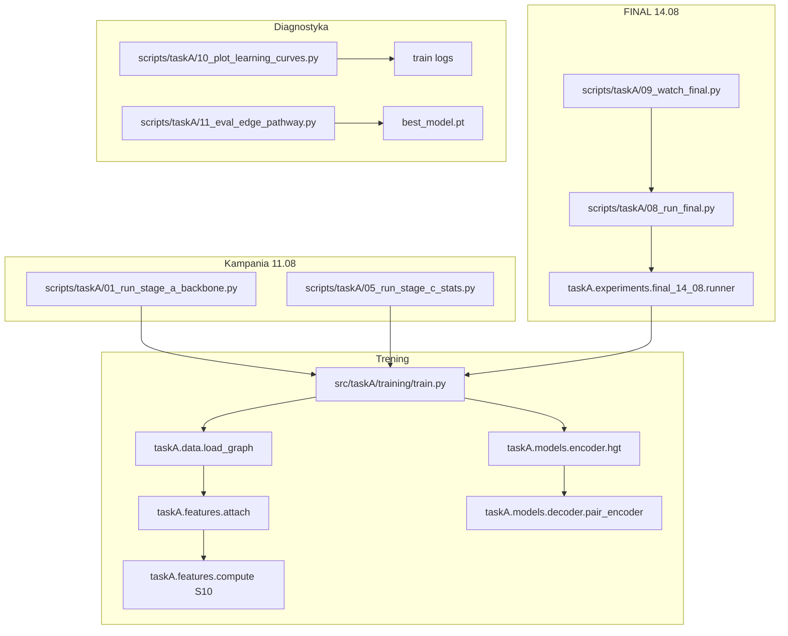

# FINAL 14.08.2026 — mapa kodu i skryptów

Konwencja: `src/taskA/<etap>/` oraz `scripts/taskA/00_…11_`.

## Diagram

Kolejność odtwarzania: **00 → 01 → 05 → 08 → 10 → 11** (02, 03, 04, 06, 07, 09 opcjonalne).

## FINAL 14.08

| Ścieżka | Rola |
|---|---|
| `src/taskA/experiments/final_14_08/` | seedy, freeze, runner 60 jobów |
| `scripts/taskA/08_run_final.py` | CLI |
| `scripts/taskA/09_watch_final.py` | watchdog |
| `scripts/taskA/10_plot_learning_curves.py` | krzywe |
| `scripts/taskA/11_eval_edge_pathway.py` | pathway report |
| `src/taskA/models/decoder/pair_encoder.py` | MLP vs KAN |

## Kampania 11.08 (nie nadpisuj outputów)

| Ścieżka | Rola |
|---|---|
| `src/taskA/experiments/stage_a_backbone/` | wyścig encoderów |
| `src/taskA/experiments/stage_c_stats/` | S0–S10 |
| `src/taskA/models/decoder/fusion88.py` | kontrakt 64+24=88 |
| `scripts/taskA/00_build_context_registry.py` | rejestr Z |
| `outputs/taskA_final_large_grid_11.08.2026/` | freeze + tabele |

## Jeden job FINAL

1. `runner.build_overrides` → HGT freeze + `fusion88_stat` + S10 + mlp/kan
2. `train.main` ładuje GSN v3
3. `fit_and_attach_stage_c_stats` na **train patients** → `stat_raw [N,3,40]`
4. HGT L=2 → embeddingi 32-D
5. Decoder: `g_graph∈R64` + `g_stat∈R24` → fusion 88 → logit
6. Early stop na valid AUPRC; test sealed
