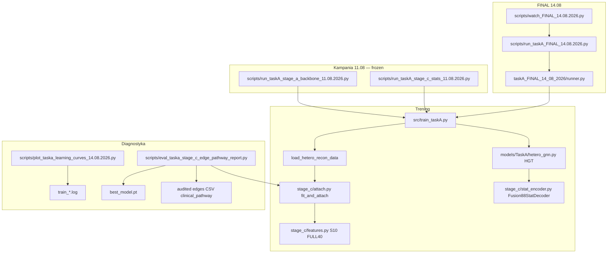

# FINAL 14.08.2026 — mapa kodu i zależności skryptów (git-ready)

Cel: jeden dokument do pusha — **co robi każdy plik** i **jak się łączą**.

## Diagram zależności

## Pliki FINAL (14.08) — nowe / kluczowe

| Ścieżka | Rola |
|---|---|
| [`src/taskA_FINAL_14_08_2026/__init__.py`](../../src/taskA_FINAL_14_08_2026/__init__.py) | Nazwa modelu, seedy, freeze hypers |
| [`src/taskA_FINAL_14_08_2026/runner.py`](../../src/taskA_FINAL_14_08_2026/runner.py) | Grid 60 jobów: S10 × mlp/kan × 6 × 5; Hydra overrides; skip-ok |
| [`scripts/run_taskA_FINAL_14.08.2026.py`](../../scripts/run_taskA_FINAL_14.08.2026.py) | CLI entry (`count` / `smoke` / `full`) |
| [`scripts/watch_FINAL_14.08.2026.py`](../../scripts/watch_FINAL_14.08.2026.py) | Watchdog (PID-file, restart) |
| [`scripts/plot_taska_learning_curves_14.08.2026.py`](../../scripts/plot_taska_learning_curves_14.08.2026.py) | Parse logów → CSV + PNG (loss, AUPRC, AUC, gap) |
| [`scripts/eval_taska_stage_c_edge_pathway_report.py`](../../scripts/eval_taska_stage_c_edge_pathway_report.py) | Predykcje × pathway / rare buckets |
| [`src/.../stage_c/stat_encoder.py`](../../src/taskA_final_large_grid_11_08_2026/stage_c/stat_encoder.py) | MLP + **StatKANPairEncoder**; `stat_pair_encoder=` flag |
| [`tests/test_FINAL_14_08_2026_kan.py`](../../tests/test_FINAL_14_08_2026_kan.py) | Kształty KAN twin + reg loss |

## Pliki 11.08 — frozen stack (nie nadpisywać wyników)

| Ścieżka | Rola |
|---|---|
| `src/taskA_final_large_grid_11_08_2026/stage_a_*.py` | Backbone race |
| `src/taskA_final_large_grid_11_08_2026/fusion88_decoder.py` | Graph 64 + zeros 24 → 88 |
| `src/taskA_final_large_grid_11_08_2026/stage_c/*` | S0–S10 features / attach / variants |
| `scripts/run_taskA_stage_a_backbone_11.08.2026.py` | Stage A CLI |
| `scripts/run_taskA_stage_c_stats_11.08.2026.py` | Stage C CLI |
| `outputs/taskA_final_large_grid_11.08.2026/` | Freeze + wyniki Stage A/C |

## Przepływ danych (jeden job FINAL)

1. `runner.build_overrides` → Hydra: HGT freeze + `fusion88_stat` + `stat_raw_dim=40` + `stat_pair_encoder=mlp|kan_shallow`
2. `train_taskA.main` ładuje hetero GSN v3 scenario
3. `fit_and_attach_stage_c_stats` fit **tylko train patients** → `stat_raw [N,3,40]` + masks
4. HGT L=2 → embeddingi 32-D
5. Decoder: `q_AG` → `g_graph∈R64`; 3× role encoders → `g_stat∈R24`; fusion 88 → logit
6. Early stop na **valid AUPRC**; zapis `best_model.pt` + `result_14.08.2026.json`
7. W&B group `TaskA_FINAL_14_08_2026`

## Co commitować vs nie

**Commit (kod + docs + testy):**
- `src/taskA_FINAL_14_08_2026/`
- `src/taskA_final_large_grid_11_08_2026/` (KAN w `stat_encoder`)
- `scripts/run_taskA_FINAL_*.py`, `watch_FINAL_*.py`, `plot_taska_learning_curves_*.py`, `eval_taska_stage_c_edge_pathway_report.py`
- `tests/test_FINAL_14_08_2026_kan.py`, `tests/test_stage_c_stats_11_08_2026.py`
- `outputs/taskA_FINAL_14.08.2026/*.md`, `MANIFEST_*.json` (lekkie artefakty dokumentacyjne)
- `outputs/taskA_final_large_grid_11.08.2026/**/*.md` + summary JSON (jeśli już trackowane)

**Zwykle nie commitować / `.gitignore`:**
- pełne `best_model.pt`, ogromne `train_*.log`, lokalne `wandb/`
- (opcjonalnie commituj małe CSV summary / tabele md z raportów)

## Kolejność uruchomienia

1. Testy jednostkowe  
2. `plot_... --source 11.08` (krzywe z istniejącego S10)  
3. `eval_... --source 11.08` (pathway early)  
4. `watch_FINAL_14.08.2026.py` (60 jobów)  
5. Po COMPLETE: curves `--source final` + pathway `--source final`
